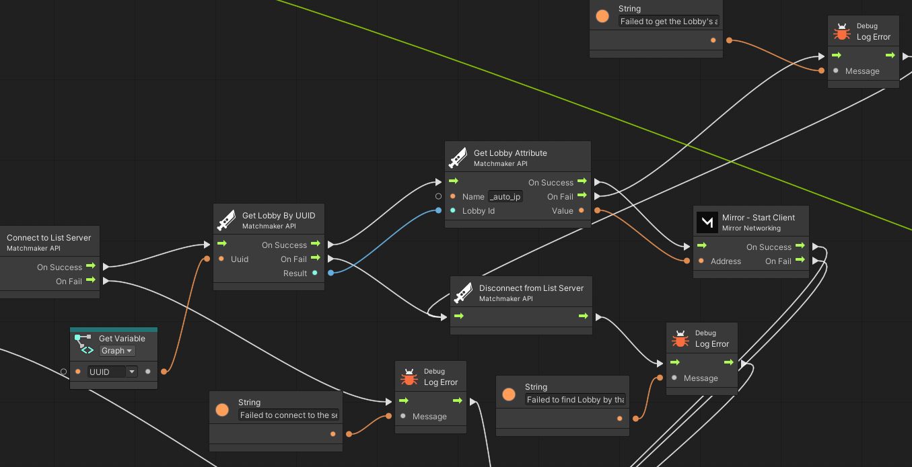

  
# Matchmaker-API - Unity3D Client
 

<h2>Introduction</h2>
This is a project for implementing a Matchmaker API into Unity3D.
 
It can be expanded with custom packets as needed.
 
 
It depends on another project to be used in Unity. https://github.com/Techiesplash/Matchmaker-API-Server
  
This project is built upon MIT-Licensed code by Tom Weiland meant for a tutorial series.
Please check out his work: https://github.com/tom-weiland/tcp-udp-networking
 

<h2>Setup</h2>
To start, you can either download this project as a .ZIP file and place the files in your project,
or you can click on your Project files in Unity Editor and use Import > Custom Package and import a package from Releases.
  
This includes Visual Scripting support. If you want to use this feature, ensure VIsual Scripting is enabled in Project Settings > Visual Scripting. You may also need to regenerate the nodes in Project Settings > Visual Scripting > Regenerate Nodes.
  
<h3>Anyone is free to use, copy, modify, merge, publish, distribute, sublicense, or and/or sell copies of the software.</h3>
